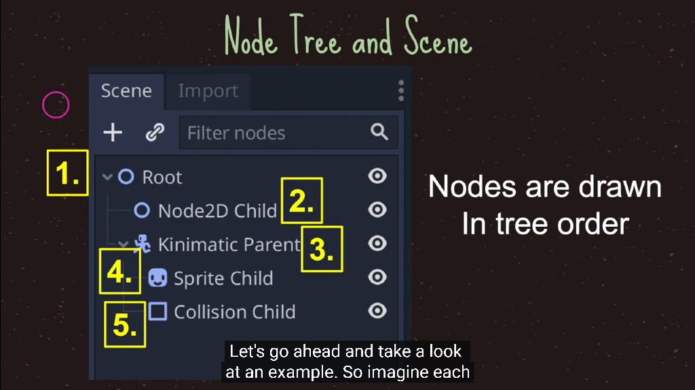

# 1. 节点的显示和隐藏

- 删除游戏对象

```
右键 Delete ，或者键盘 Delete 均可
```

- 恢复

```
CTRL + Z ，撤销上一步操作
```

- 更改节点对象名字

```
右键 Rename，或者双击节点修改
```

- 显示 / 隐藏

```
在 Inspector 里，勾选 Visible 复选框，或者在节点右侧点击Toggle Visibility
```

- 设置长宽比

```
在 Project | Project Settings | Display | Window 中可以设置长宽比
```

# 2. 游戏节点的显示顺序

- 在2D画面中，两个对象如果重叠，谁显示在上面呢？
- 按照节点的顺序




# 3. 节点的轴心

- 轴心 Pivot ，指旋转轴、坐标基准点，默认在对象的几何中心

- 轴心的作用：

```
旋转轴
当旋转对象时，是以 Pivot 为轴心来计算的
```

- 添加一个勋章图片，设置其 Pivot 位置，练习以下

# 4. 节点的父子关系

- 在层级树中，对象 (节点) 呈树形显示，一个节点下面，也可以下挂子节点

- 演示：

```
1 添加三个对象 ：边框、22娘、小电视
2 拖拽一个对象到另一个对象，成为子对象 (子节点)
3 移动父对象、旋转父对象，观察

可以发现，当父对象移动时，子对象随之移动
```

- 理解相对坐标

```
子对象的坐标轴，是相对于父对象的
1 移动父对象时，子对象的 Position 不发生变化
2 旋转父对象时，子对象的 Rotation 不发生变化
```
