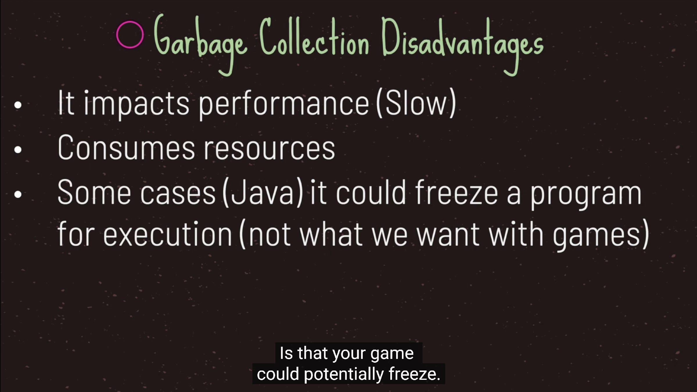
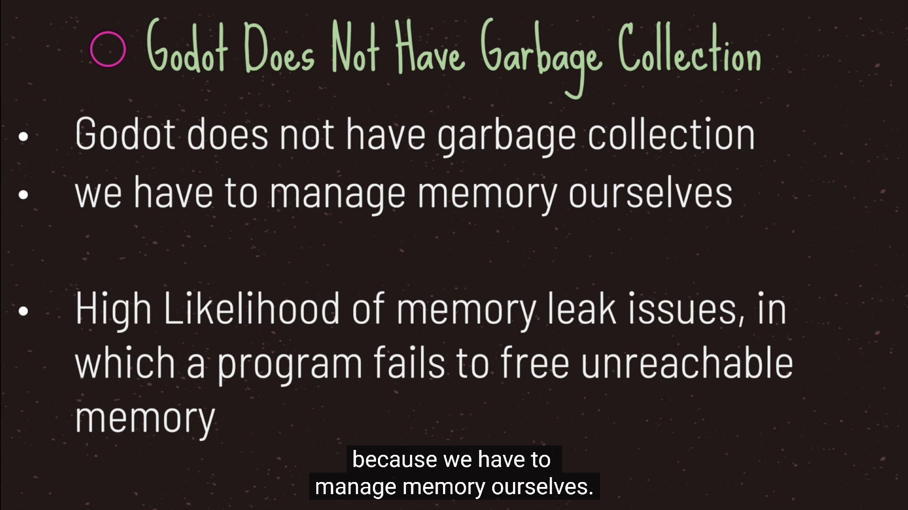

- 参考资料
- [godot官方文档](https://docs.godotengine.org/en/stable/getting_started/scripting/gdscript/gdscript_basics.html)
- [Godot Tutorials的GDScript Fundamentals Tutorial Series，youtube播放量最高的godot教程视频](https://www.youtube.com/watch?v=JJQa3xrRNM0&list=PLJ690cxlZTgL4i3sjTPRQTyrJ5TTkYJ2_)
- [Godot Tutorials的Godot Basics Tutorial Series，youtube播放量最高的godot教程视频](https://www.youtube.com/watch?v=sChM51ibm5k&list=PLJ690cxlZTgIsmdEhFufnB7O6KWoMS8M6)
- [B站视频](https://www.bilibili.com/video/BV17g4y1z7uS)

# 1. 脚本

- 游戏脚本 Script ，用代码来控制游戏对象
- godot使用 GdScript 作为脚本语言
- 注意：自本章开始，每节课的项目源码都放在了github项目godot-start，可以直接对照示例项目
- 游戏开发，也是一种程序设计，如果是0基础的同学，建议先学习一个强类型语言比如Java，C#，C++，再来学习GdScript就一通百通了

# 2. 脚本的使用

- 如何使用一个脚本？
```
新建脚本 hello.gd ，编辑代码 ，保存一下
把脚本挂载到游戏节点上
运行游戏，点 Play Scene 运行当前游戏场景，在 Output 窗口里观察打印输出
```

# 3. 认识脚本

- GdScript脚本特点，因为是GdScript是弱类型语言，所以比较自由，但是我们可以约定一些准时的原则让代码更加的规范：
```
1 类名必须与文件名相同，且为小写
2 继承于 Node 节点，所有的脚本都继承于这个类，Node 节点是脚本控制最多的节点
3 默认定义了一些事件函数，例如，
  _init()  脚本初始化的时候调用
  _ready()  开始调用一次，可用于初始化
  _process(delta) 每帧调用，帧间隔不等，可用于更新游戏
4 内部执行顺序，_init  _ready  _process
```


# 数据类型

- gds有5种基础类型
    - bool，一个字节，默认为false
    - int(同C++和Java long)，8个字节，默认为0
    - float(同C++和Java double)，8个字节，默认为0
    - String.默认为null
    - null，变量没有被赋值，则默认为null


# 垃圾回收






- gdscript是垃圾回收和手动回收结合起来了，使用什么样的回收完全交给你自己
  


