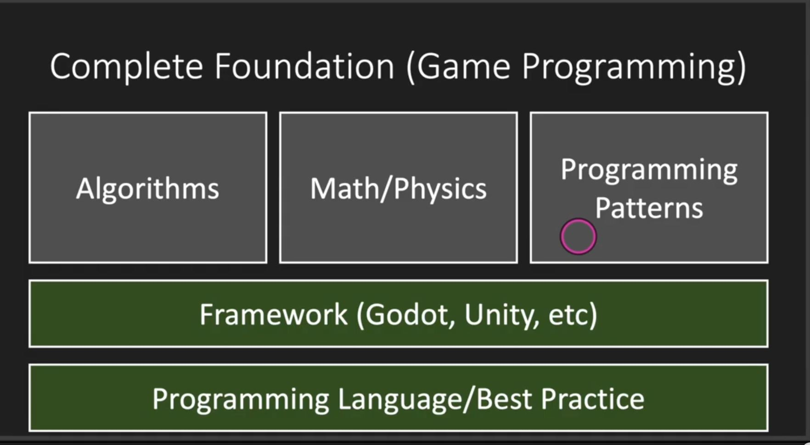

# 1. 脚本的定义

- 游戏脚本 Script ，用代码来控制游戏对象
- godot使用 GdScript 作为脚本语言
- 注意：自本章开始，每节课的项目源码都放在了github项目godot-start，可以直接对照示例项目
- 游戏开发，也是一种程序设计，如果是0基础的同学，建议先学习一个强类型语言比如Java，C#，C++，再来学习GdScript就一通百通了

# 2. 脚本的使用

- 如何使用一个脚本？

```
新建脚本 hello.gd ，编辑代码 ，保存一下
把脚本挂载到游戏节点上
运行游戏，点 Play Scene 运行当前游戏场景，在 Output 窗口里观察打印输出
```

# 3. 认识脚本

- 因为是GdScript是弱类型语言，所以比较自由，但是我们可以约定一些准时的原则让代码更加的规范：

```
类名必须与文件名相同，且为小写
尽量继承于 Node2D 节点，Node2D 节点中的Transform是我们用的最多的节点
```

- 常用函数内部执行顺序，_init  _ready  _process

```
默认定义了一些事件函数，例如，
  _init()  脚本初始化的时候调用，对象的构造器，类似于Java的构造函数construct
  _ready()  开始调用一次，可用于初始化脚本
  _process(delta) 每帧调用，帧间隔不等，可用于更新游戏
```

# 4.变量和数据类型

- 变量是用于存储信息的"容器"。

```
var x=5;
var y=6;
var z=x+y;

就像代数那样
x=5
y=6
z=x+y

在代数中，我们使用字母（比如 x）来保存值（比如 5）。
通过上面的表达式 z=x+y，我们能够计算出 z 的值为 11。
在 godot 中，这些字母被称为变量。
```

- gds数据类型分类
    - bool，一个字节，默认为false
    - int(同C++和Java long)，8个字节，默认为0
    - float(同C++和Java double)，8个字节，默认为0
    - String，默认为null，字符串可以存储一系列字符，如 "John Doe"。
    - 数组
    - 对象
    - null，变量没有被赋值，则默认为null




# 5.导出变量

- export关键字可以让变量在编辑器中编辑

```
# 导出一个数字
export var a = 1
# 导出一个节点路径
export var b:NodePath
# 导出一个节点路径，不同的写法
export(NodePath) var c
# 导出一个文件路径
export(String, FILE) var e 
# 导出一个文件路径，以txt结尾
export(String, FILE, "*.txt") var d
# 导出一个资源文件路径
export(Resource) var f
# 导出一个颜色
export(Color, RGB) var g
```

# 6.函数

- 函数是可以简单的理解为当它被调用时执行的可重复使用的代码块。
- 函数就是包裹在花括号中的代码块，前面使用了关键词 func，当调用该函数时，会执行函数内的代码。

```
func sayHello()
{
    # 执行代码
}
```

- 调用带参数的函数，在调用函数时，您可以向其传递值，这些值被称为参数。

```
func sayHello(param1， param2)
{
    # 执行代码
}
```

- 带有返回值的函数，有时，我们会希望函数将值返回调用它的地方，通过使用 return 语句就可以实现。

```
func sayHello(param1， param2)
{
    # 执行代码
    return x
}
```

# 7.变量的作用域

- 局部作用域，变量在函数内声明，变量为局部作用域，只能在函数内部访问

```
# 此处不能调用 carName 变量
func myFunction() {
    var carName = "Volvo";
    # 函数内可调用 carName 变量
}
```

- 全局变量，变量在函数外定义，即为全局变量，整个脚本文件中都可以使用

```
var carName = " Volvo";
 
# 此处可调用 carName 变量
func myFunction() {
    # 函数内可调用 carName 变量
}
```

# 8. 运算符

- 算术运算符

```
+	加法	        x=y+2	7	5
-	减法	        x=y-2	3	5
*	乘法	        x=y*2	10	5
/	除法	        x=y/2	2.5	5
%	取模（余数）	x=y%2	1	5
```

- 赋值运算符，赋值运算符用于给 GdScript 变量赋值

```
=	x=y	 	x=5
+=	x+=y	x=x+y	x=15
-=	x-=y	x=x-y	x=5
*=	x*=y	x=x*y	x=50
/=	x/=y	x=x/y	x=2
%=	x%=y	x=x%y	x=0
```

- 比较运算符，比较运算符在逻辑语句中使用，以测定变量或值是否相等

```
==	等于	x==8	false
!=	 不等于	x!=8	true
>	 大于	x>8	false
<	 小于	x<8	true
>=	 大于或等于	x>=8	false
<=	 小于或等于	x<=8	true
```

- 逻辑运算符，逻辑运算符用于测定变量或值之间的逻辑。

```
&&	and	(x < 10 && y > 1) 为 true
||	or	(x==5 || y==5) 为 false
!	not	!(x==y) 为 true
```

# 9. 条件语句

- 通常在写代码时，您总是需要为不同的决定来执行不同的动作。您可以在代码中使用条件语句来完成该任务。


- if 语句 - 只有当指定条件为 true 时，使用该语句来执行代码

```
if (condition)
{
    当条件为 true 时执行的代码
}
```

- if...else 语句 - 当条件为 true 时执行代码，当条件为 false 时执行其他代码

```
if (condition)
{
    当条件为 true 时执行的代码
}
else
{
    当条件不为 true 时执行的代码
}
```

- if...else if....else 语句- 使用该语句来选择多个代码块之一来执行

```
if (condition1)
{
    当条件 1 为 true 时执行的代码
}
else if (condition2)
{
    当条件 2 为 true 时执行的代码
}
else
{
  当条件 1 和 条件 2 都不为 true 时执行的代码
}
```

- match(switch) 语句 - 使用该语句来选择多个代码块之一来执行

# 10. 循环语句

- 循环可以将代码块执行指定的次数，如果您希望一遍又一遍地运行相同的代码，并且每次的值都不同，那么使用循环是很方便的
- for
- while
- break 语句跳出循环后，会继续执行该循环之后的代码（如果有的话）
- continue 语句中断循环中的迭代，如果出现了指定的条件，然后继续循环中的下一个迭代

# 11. 数组和字典的遍历

- 数组遍历

```
func arrayIterator():
	# range等价于for(int i = 0; i < 20; i++)
	print("数组遍历方法1：")
	for i in range(3):
		print(i)
	print("数组遍历方法2：")
	for ele in arr:
		print(ele)
	print("数组遍历方法3：")
	for index in range(arr.size()):
		print(arr[index])
```  

- 字典遍历

```
func dictionaryIterator():
	print("字典遍历方法1：")
	for key in dict:
		print("key:" + key as String)
		print("value:" + dict[key] as String)
		
	print("字典遍历方法2：")
	for key in dict.keys():
		print("key:" + key as String)
		print("value:" + dict[key] as String)
		
	print("字典遍历方法3：")
	for value in dict.values():
		print("value:" + value as String)	
```  

# 12. 静态变量和静态方法

- const变量（静态变量）

```
const ANSWER = 42
```

- 静态方法

```
static func getAnswer():
	return ANSWER
```

# 13. 对象

- 真实生活中的对象，属性和方法
- 真实生活中，一辆汽车是一个对象。对象有它的属性，如重量和颜色等，方法有启动停止等

```
# Inner class，默认继承Object
class Animal:
	extends Object  # 如果不指定继承的类，默认基础Object
	const STATIC_FIELD = "静态变量"
	# 属性
	var height: int
	
	func _init():
		print("Animal 构造方法")
		
	func move():
		print("animal，移动")
	
	static func staticFuction():
		pass
```

# 14. 调试

- 在编写 GdScript 时，如果没有调试工具将是一件很痛苦的事情。
- 你的代码可能包含语法错误，逻辑错误，有了调试工具，这些错误比较容易发现。

# 15. 参考资料

- [godot官方文档](https://docs.godotengine.org/en/stable/getting_started/scripting/gdscript/gdscript_basics.html)
- [Godot Tutorials的GDScript Fundamentals Tutorial Series，youtube播放量最高的godot教程视频](https://www.youtube.com/watch?v=JJQa3xrRNM0&list=PLJ690cxlZTgL4i3sjTPRQTyrJ5TTkYJ2_)
- [Godot Tutorials的Godot Basics Tutorial Series，youtube播放量最高的godot教程视频](https://www.youtube.com/watch?v=sChM51ibm5k&list=PLJ690cxlZTgIsmdEhFufnB7O6KWoMS8M6)
- [B站视频](https://www.bilibili.com/video/BV17g4y1z7uS)
