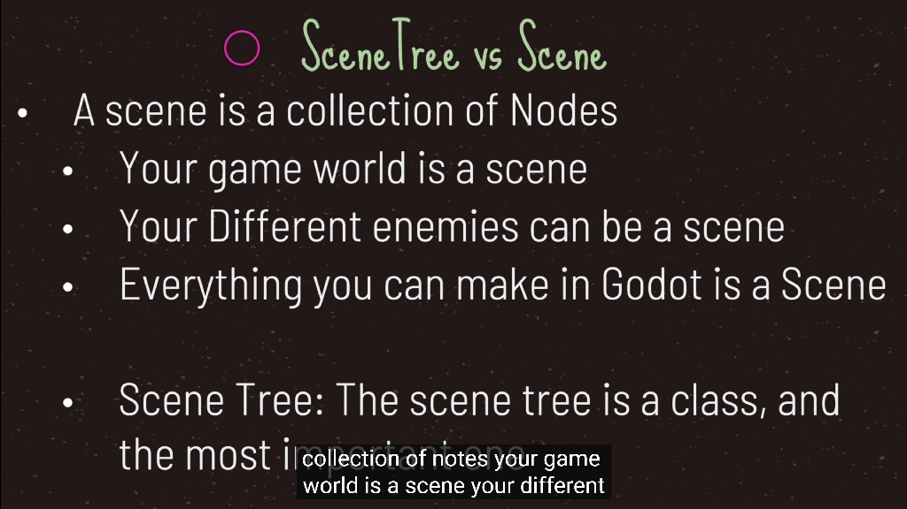
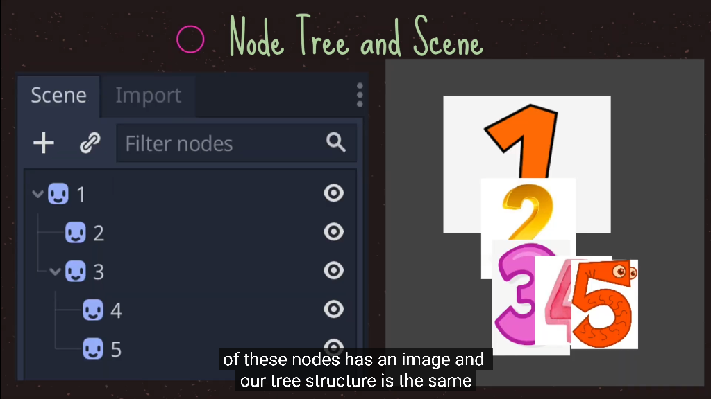
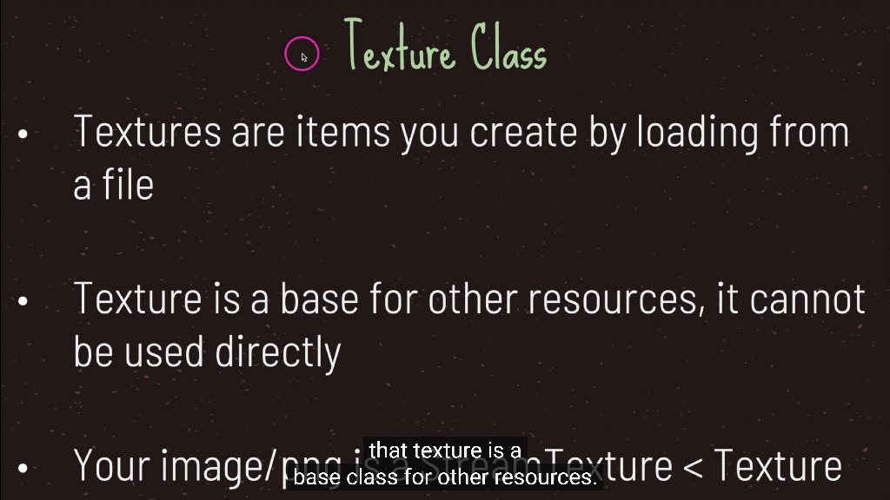
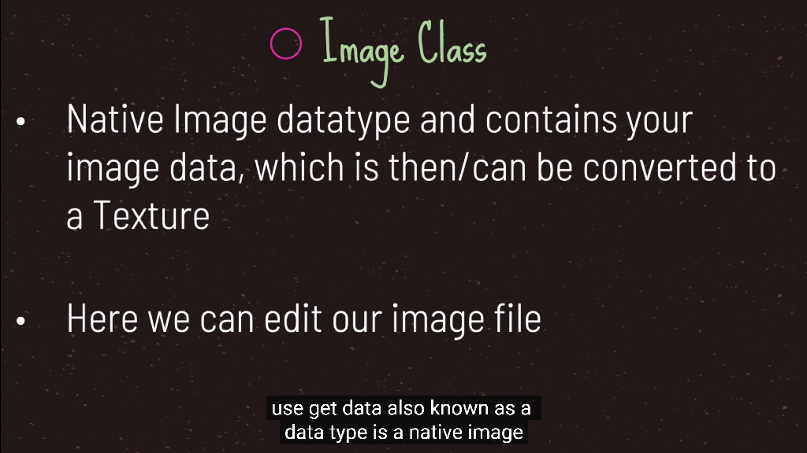

# 1. 深入坐标系


```
因为刚开始的时候有点疑惑，godot的坐标系，原点既然在左上角。
unity，cocos的2d原点都在左下角，就很符合数学里面的象限，左下角的2d坐标系感觉很复合习惯。

后来了解到，计算机屏幕是从左上角开始刷新的，2d坐标系左上角为原点可以屏幕坐标系吻合可以提升一点效率。  

unity的2d坐标系虽然在左下角，但是unity的屏幕坐标系依然在左上角，不统一。
虽然godot的2d坐标系在左上角的坐标系刚开始看不舒服，但是和屏幕坐标系吻合了，也算一种统一，就不需要untiy2d的那么多概念了，为godot点赞。

因为单论平面内容制作，左上原点更符合视觉习惯，也更符合设计常识，比如ps。
```

# 2. 全局和相对坐标的相互转化

- 全局坐标和局部坐标（相对坐标）可以相互转化

```
Node2D及其子节点的位置可以使用position和gloabl_position来控制。
其中，前者是该节点相对于父节点的相对位置，后者是全局位置。

简而言之，position的坐标系是以父节点的位置坐标为原点的坐标系，方向，还是水平向右为x轴正方向，竖直向下为y轴正方向。
需要注意的是，全局位置是以场景的左上角为原点的，并不是以根结点的位置作为原点的
```

# 3. 场景和节点






- 一个游戏可以包含多个场景，但是一个场景中必须有一个根节点，一个根节点可以包含多个不重名的子节点（unity的子节点可以同名），不同名更加符合习惯，为godot点赞。

# 4. 基本组件

- CanvasItem，
  
  
  
  
  
