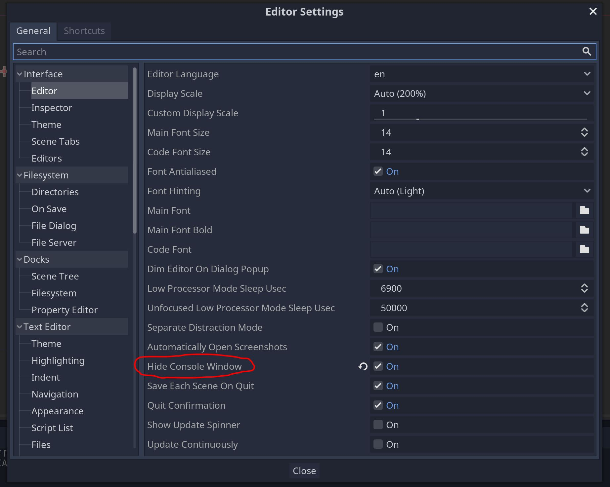
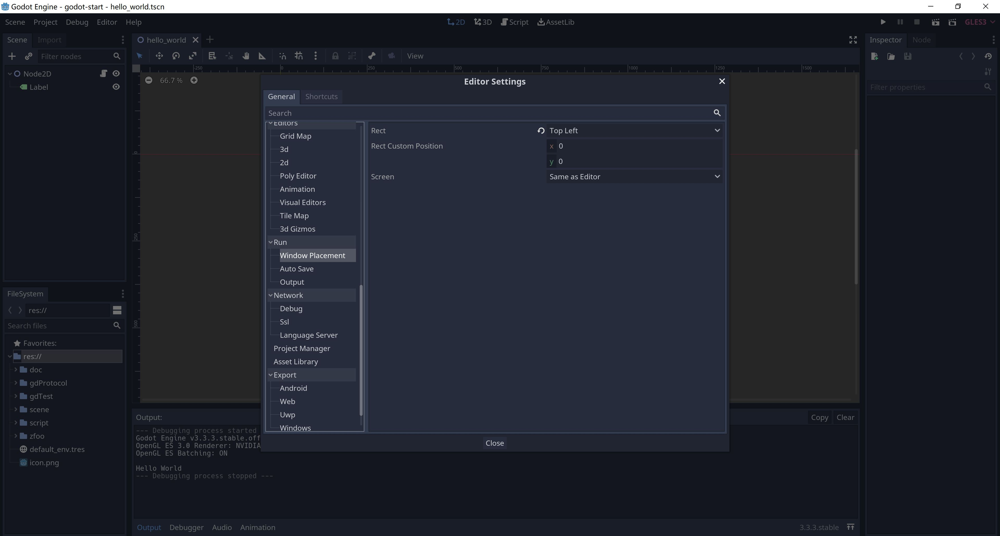
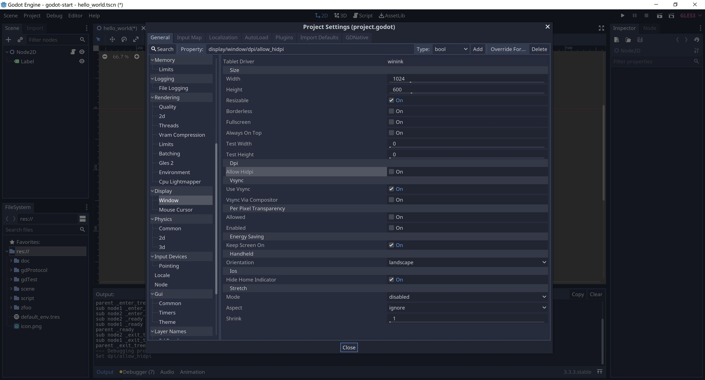
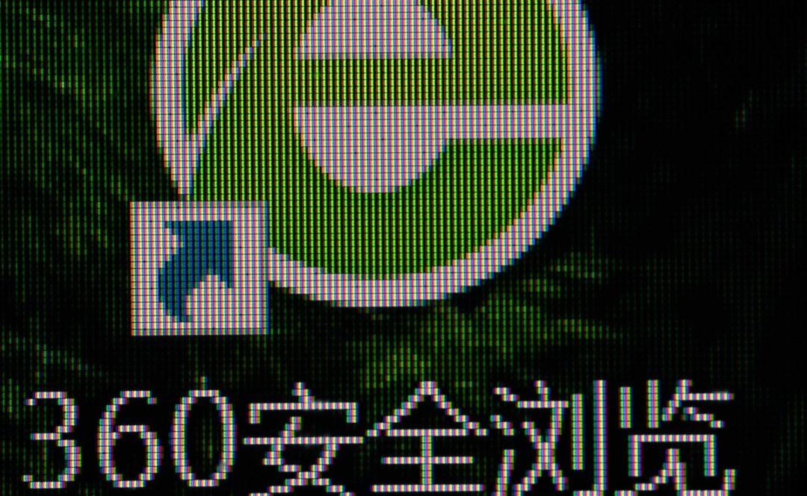
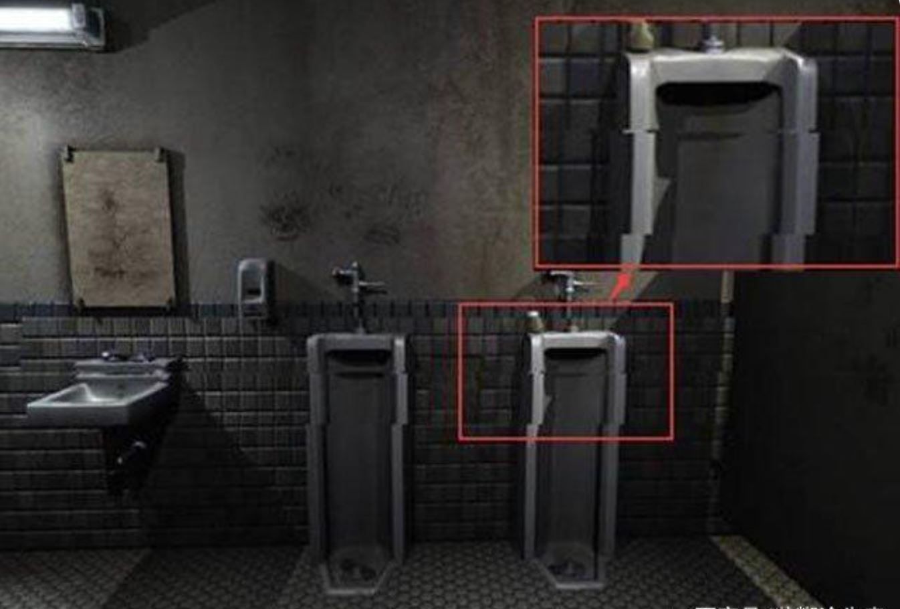
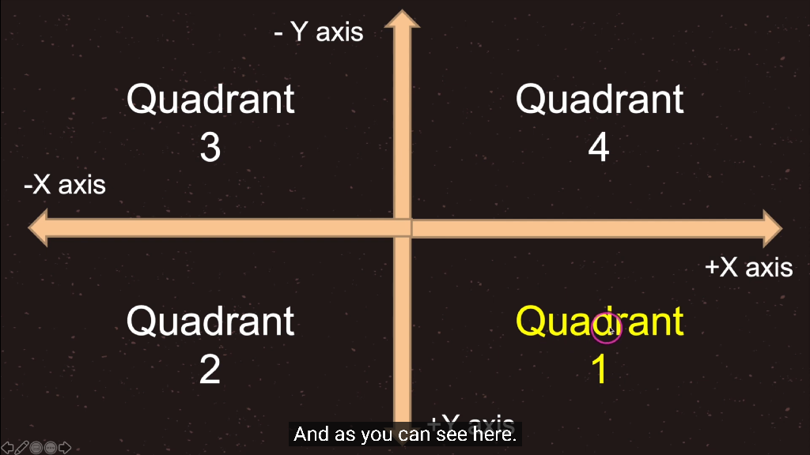
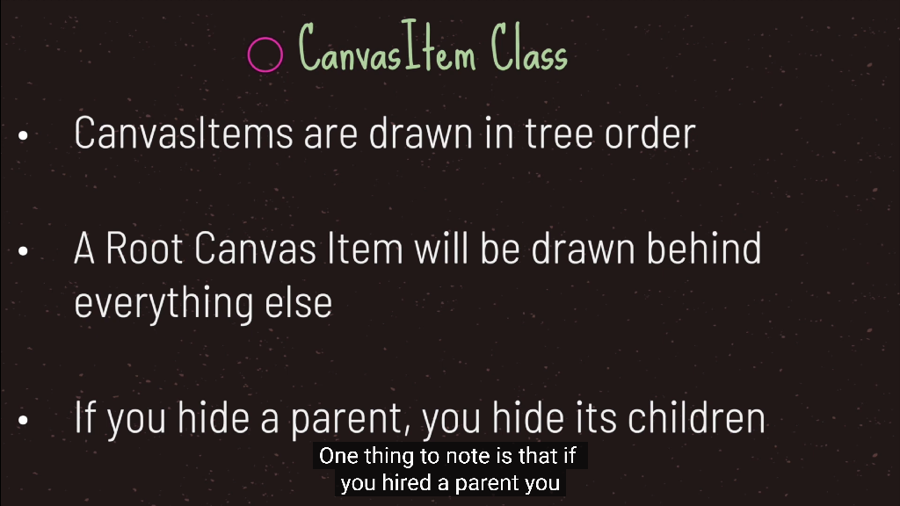

# 1. 屏幕窗口设置

- Editor | Editor Settings | Editor，设置控制台是否隐藏
  

- Editor | Editor Settings | Window Placement，设置编辑器运行游戏窗口的位置
  

- Project | Project Settings | Display，设置游戏窗口的大小等相关参数
  

- Project | Project Settings | Display | Hide Home Indicator，ios的 Home 键指示隐藏
  

# 2. 单位和像素

- 屏幕分辨率（屏幕像素），屏幕分辨率是指纵横向上的像素点数，单位是px，4:3 是最常见屏幕比例，显示设置可以看到


- 图片像素

  


- 屏幕像素和图片像素有什么关系

```
在屏幕显示图片时，如果屏幕的长宽比、像素数和图片一致，只需要每个屏幕像素的像素点表示出图片上的像素就可以了，1:1对应显示出来。
那如果图片像素数和屏幕像素数不一样呢？

当图片像素大于屏幕像素时，屏幕也是进行合并显示的。
比如一张1200W像素的图片，要在300W像素的显示器（长宽比一致）上显示，那么系统就需要将图片像素进行四合一计算然后再显示。
当图片像素数大于屏幕像素数时，高像素图片和低像素图片的显示精细度是一样的！
```

- DPI（dots per inch），DPI在高分辨率显示器和手机普及之后，调了之后，画面上的字体等会变大变小。

```
比如我使用一个27寸的4k显示器，如果DPI 100%的话，那么字体就是27英寸的1080p显示器的1/4大小，完全没法看了。
这个时候，使用DPI 200%，字就又大又清楚了。

这个过程在windows上面就是DWM（desktop windows manager）做了scaling。
```

- 在godot中，一般position的1个单位长度等于1个图片像素

# 3. 垂直同步


- Vsync，垂直同步又称场同步（Vertical Hold）

```
我们平时所说的打开垂直同步指的是将该信号送入显卡3D图形处理部分，从而让显卡在生成3D图形时受垂直同步信号的制约。

当我们选择"等待垂直同步信号"（即打开垂直同步）时，显卡绘制3D图形前会等待垂直同步信号，
当该信号到达时，显卡开始绘制3D图形，如果显卡性能较为强劲，在下个垂直同步信号到来之前已经完成了对该帧的渲染，
显卡就会暂停处理，等下个垂直同步信号到来后才开始渲染下一帧。
由此可见，当打开垂直同步时，游戏的FPS要受刷新率的制约，对于高端显卡而言，限制了其性能的发挥。

假设我们选择不等待垂直同步信号（也就是我们平时所说的关闭垂直同步），
那么游戏中作完一屏画面，显卡和显示器无需等待垂直同步信号就能够開始下一屏图像的绘制，自然能够全然发挥显卡的实力。
可是不要忘记，正是由于垂直同步的存在，才干使得游戏进程和显示器刷新率同步，使得画面更加平滑和稳定。
取消了垂直同步信号，固然能够换来更快的速度，可是在图像的连续性上势必打折扣。
这也正是非常多朋友抱怨关闭垂直后发现画面不连续的理论原因。
```




- CRT显示器学名为“阴极射线显像管”，是一种使用阴极射线管（Cathode Ray Tube）的显示器。

```
屏幕上的图形图像是由一个个因电子束击打而发光的荧光点组成

电子枪从屏幕的左上角的第一行(行的多少根据显示器当时的分辨率所决定，比如800X600分辨率下，电子枪就要扫描600行)开始，从左至右逐行扫描，
第一行扫描完后再从第二行的最左端开始至第二行的最右端，一直到扫描完整个屏幕后再从屏幕的左上角开始，这时就完成了一次对屏幕的刷新，周而复始。

从CRT显示器的显示原理来看，单个像素组成了水平扫描线，水平扫描线在垂直方向的堆积形成了完整的画面。
显示器的刷新率受显卡DAC控制，显卡DAC完成一帧的扫描后就会产生一个垂直同步信号。
```

- 液晶显示器借助于薄膜晶体管驱动的有源矩阵液晶显示器，它主要是以电流刺激液晶分子产生点、线、面配合背部灯管构成画面。

```

在电场的作用下，利用液晶分子的排列方向发生变化，使外光源透光率改变（调制），完成电一光变换，
再利用R、G、B三基色信号的不同激励，通过红、绿、蓝三基色滤光膜，完成时域和空间域的彩色重显。

LCD的刷新率与CRT不同，因为LCD和CRT的显像方式不同，CRT是靠不断刷新画面来使显示器显示图像的，而LCD只要改变发光颗粒就能使显示器中的画面动起来
正是由于LCD与CRT显像方式不同，LCD显示器本身不会出现屏幕闪烁的现象

打开垂直同步可以使得画面平滑、稳定。
关闭垂直同步，则可以明显提高帧数，获得更快的速度，代价就是牺牲稳定性，显卡持续高负荷运转势必发热，进而影响计算速度。
```

# 4. 屏幕坐标




- 刚开始学习的时候可能有点疑惑，godot的坐标系，原点既然在左上角
- unity，cocos的2d原点都在左下角，就很符合数学里面的象限，左下角的2d坐标系感觉很复合习惯

```
后来了解到，计算机屏幕是从左上角开始刷新的，2d坐标系左上角为原点可以屏幕坐标系吻合可以提升一点效率。  

unity的2d坐标系虽然在左下角，但是unity的屏幕坐标系依然在左上角，不统一。
虽然godot的2d坐标系在左上角的坐标系刚开始看不舒服，但是和屏幕坐标系吻合了，也算一种统一，就不需要untiy2d的那么多概念了，为godot点赞。

因为单论平面内容制作，左上原点更符合视觉习惯，也更符合设计常识，比如ps。
```


- 世界坐标系：又称为全局坐标系，以场景树的root节点为坐标系原点
- 相对坐标系：又称为局部坐标系或者本地坐标系，相对于父节点的坐标，godot的坐标都是相对坐标
- 屏幕坐标：屏幕的左上角为坐标系原点

# 5. 全局和相对坐标的相互转化

- 全局坐标和局部坐标（相对坐标）可以相互转化

```
Node2D及其子节点的位置可以使用position和gloabl_position来控制。
其中，前者是该节点相对于父节点的相对位置，后者是全局位置。

简而言之，position的坐标系是以父节点的位置坐标为原点的坐标系，方向，还是水平向右为x轴正方向，竖直向下为y轴正方向。
需要注意的是，全局位置是以场景的左上角为原点的，并不是以根结点的位置作为原点的
```

```
# 坐标点测试用例
func positionTest():
	print(position)
	print(global_position)
	print(to_global(position))
	print(to_local(global_position))
	pass
```

# 6. 深度遍历显示节点


- 一个游戏可以包含多个场景，但是一个场景中必须有一个根节点，一个根节点可以包含多个不重名的子节点（unity的子节点可以同名），不同名更加符合习惯，为godot点赞。

- fix：纠正P25说的深度优先遍历顺序，绘制节点的顺序应该是广度优先遍历

# 7. Image类的使用

- CanvasItem节点，CanvasItem -> Node -> Object
- Canvas是画布的意思，所以CanvasItem代表了就是可以被绘制节点，可以设置可视化界面和材质的颜色
- 所有的2D节点和GUI节点都继承于CanvasItem节点
  
  


- Sprite节点，Node2d -> CanvasItem -> Node -> Object
- 用来显示一张图片
  


- Texture类，Resource -> Reference -> Object
- Texture 贴图，附加到物体表面的贴图，实际上就是包含一张Image图片
- 可以用在3D模型中当作贴图，或者2D的Sprite中当作图片，或者GUI的背景
  


- Image类，Resource -> Reference -> Object
- 包含了图片的数
  


- 总结
  
