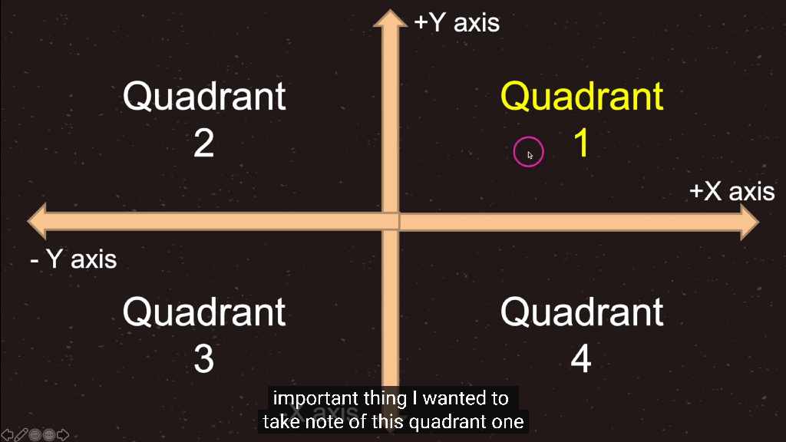
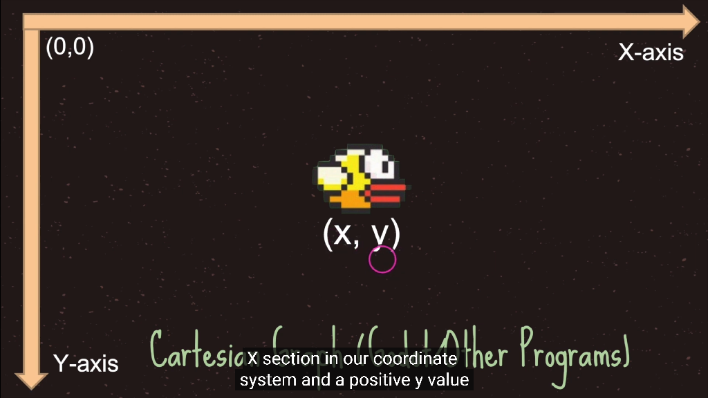
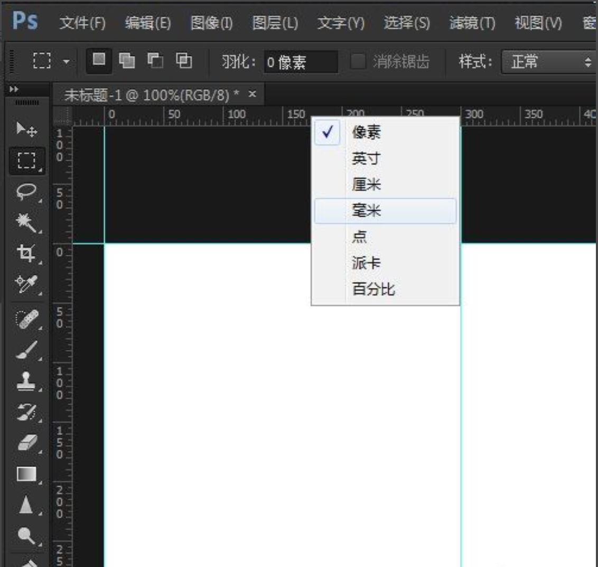
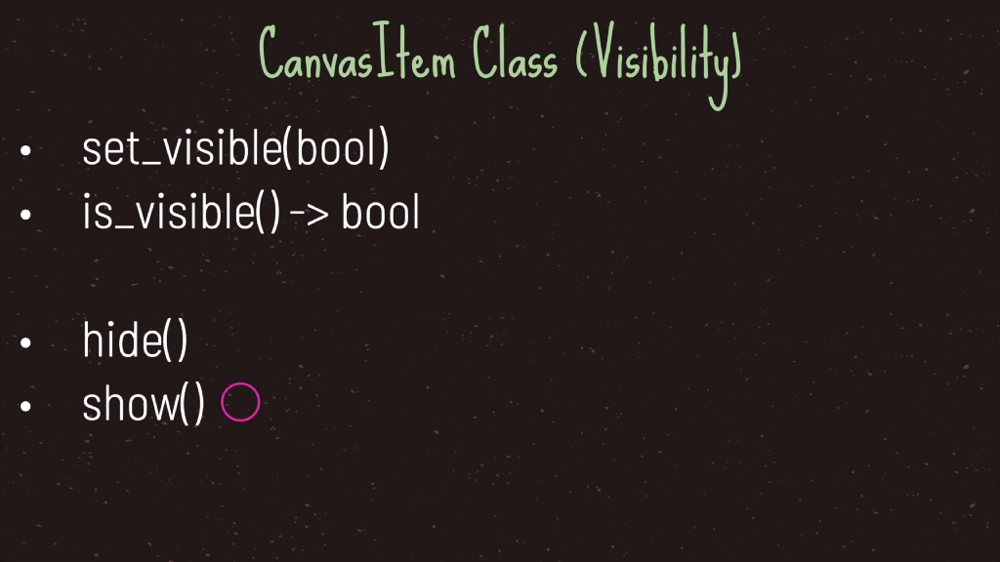
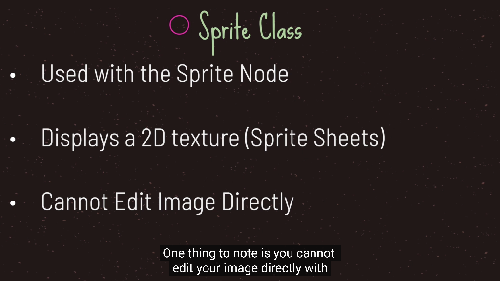
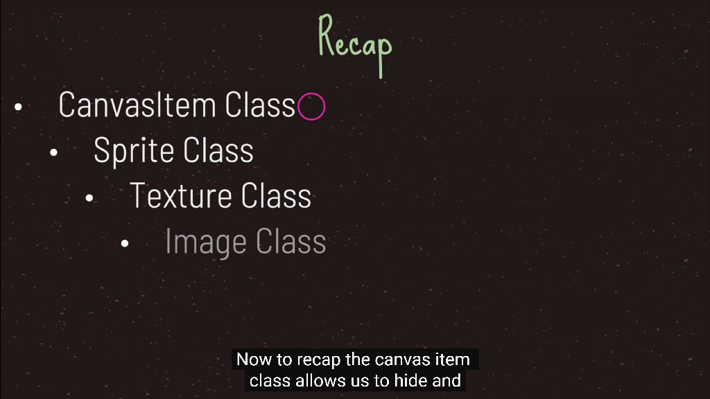

# 1. 屏幕坐标






```
因为刚开始的时候有点疑惑，godot的坐标系，原点既然在左上角。
unity，cocos的2d原点都在左下角，就很符合数学里面的象限，左下角的2d坐标系感觉很复合习惯。

后来了解到，计算机屏幕是从左上角开始刷新的，2d坐标系左上角为原点可以屏幕坐标系吻合可以提升一点效率。  

unity的2d坐标系虽然在左下角，但是unity的屏幕坐标系依然在左上角，不统一。
虽然godot的2d坐标系在左上角的坐标系刚开始看不舒服，但是和屏幕坐标系吻合了，也算一种统一，就不需要untiy2d的那么多概念了，为godot点赞。

因为单论平面内容制作，左上原点更符合视觉习惯，也更符合设计常识，比如ps。
```

- 世界坐标系：又称为全局坐标系，以场景树的root节点为坐标系原点
- 相对坐标系：又称为局部坐标系或者本地坐标系，相对于父节点的坐标，godot的坐标都是相对坐标
- 屏幕坐标：屏幕的左上角为坐标系原点


- 屏幕分辨率，屏幕分辨率是指纵横向上的像素点数，单位是px，4:3 是最常见屏幕比例
  


- 屏幕像素和图片像素有什么关系

```
在屏幕显示图片时，如果屏幕的长宽比、像素数和图片一致，只需要每个屏幕像素用子像素的敏感组合表示出图片上的像素就可以了。
那如果图片像素数和屏幕像素数不一样呢？

当图片像素大于屏幕像素时，屏幕也是进行合并显示的。
比如一张1200W像素的图片，要在300W像素的显示器（长宽比一致）上显示，那么系统就需要将图片像素进行四合一计算然后再显示。
当图片像素数大于屏幕像素数时，高像素图片和低像素图片的显示精细度是一样的！


```

- 在godot中，一般position的1个单位长度等于1个图片像素

# 2. 全局和相对坐标的相互转化

- 全局坐标和局部坐标（相对坐标）可以相互转化

```
Node2D及其子节点的位置可以使用position和gloabl_position来控制。
其中，前者是该节点相对于父节点的相对位置，后者是全局位置。

简而言之，position的坐标系是以父节点的位置坐标为原点的坐标系，方向，还是水平向右为x轴正方向，竖直向下为y轴正方向。
需要注意的是，全局位置是以场景的左上角为原点的，并不是以根结点的位置作为原点的
```

# 3. 场景和节点


- 一个游戏可以包含多个场景，但是一个场景中必须有一个根节点，一个根节点可以包含多个不重名的子节点（unity的子节点可以同名），不同名更加符合习惯，为godot点赞。

# 4. 基本组件

- CanvasItem节点，CanvasItem -> Node -> Object
- Canvas是画布的意思，所以CanvasItem代表了就是可以被绘制节点，可以设置可视化界面和材质的颜色
- 所有的2D节点和GUI节点都继承于CanvasItem节点
  


- Sprite节点，Node2d -> CanvasItem -> Node -> Object
- 用来显示一张图片
  


- Texture类，Resource -> Reference -> Object
- Texture 贴图，附加到物体表面的贴图，实际上就是包含一张Image图片
- 可以用在3D模型中当作贴图，或者2D的Sprite中当作图片，或者GUI的背景
  


- Image类，Resource -> Reference -> Object
- 包含了图片的数
  


- 总结
  
