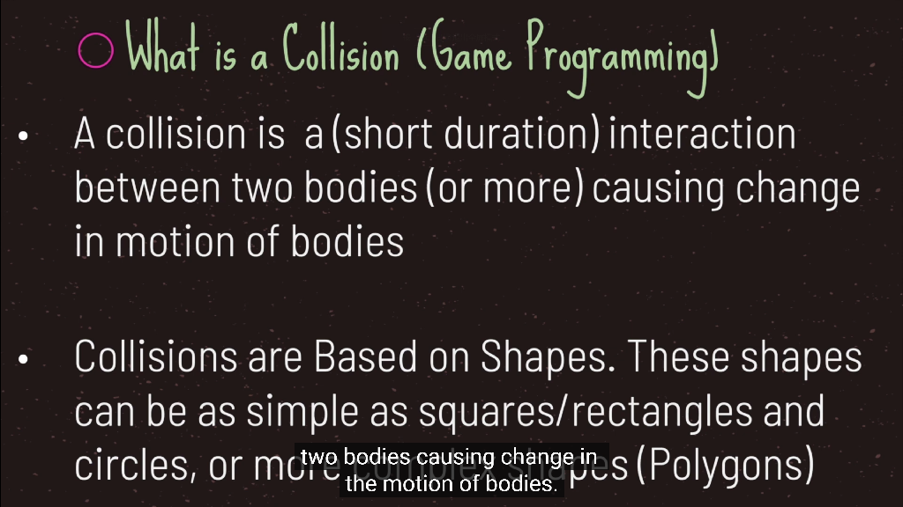
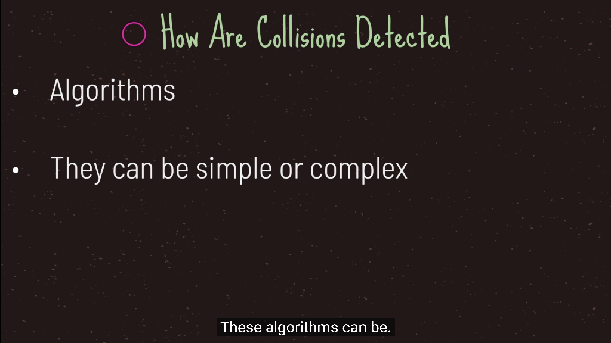
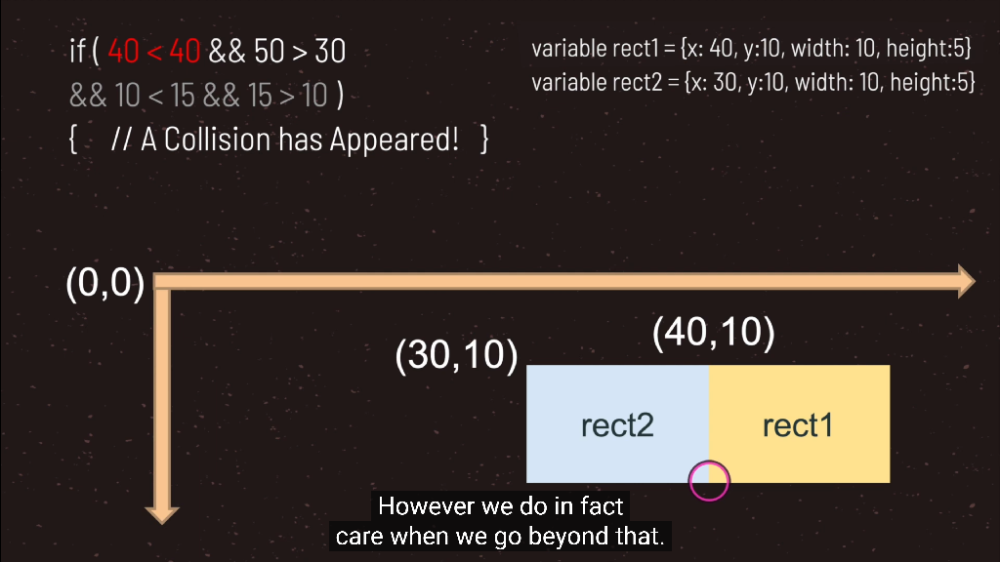
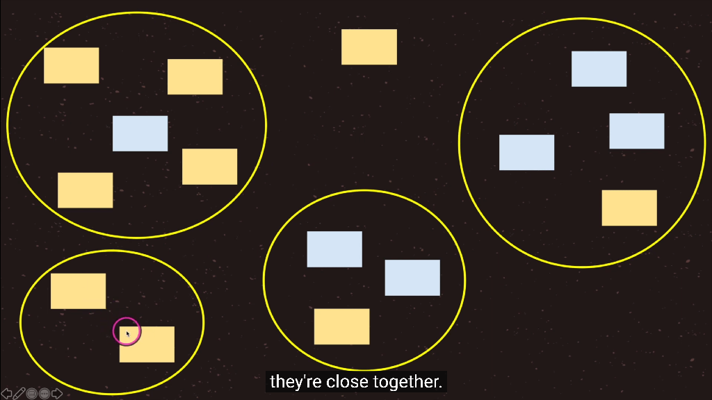

# 1. 物理系统

- 物理系统（PhysicsSystem）用于管理所有物理相关的功能，目前它负责同步物理元素、触发物理事件和调度物理世界的迭代。
- 物理世界迭代时会对物理元素进行物理计算，比如计算各物体是否产生碰撞，以及物体的受力情况。当计算完成后，物理系统会将物理世界更新到场景世界中，从而使游戏对象产生相应的物理行为。
- Godot 的物理系统提供了高效的组件化工作流程和便捷的使用方法。目前支持刚体、碰撞组件、触发和碰撞事件

# 2. 刚体

- 刚体是组成物理世界的基本对象，你可以将刚体想象成一个你不能看到（绘制）也不能摸到（碰撞）的带有属性的物体。

- mass，刚体质量
- weight，刚体加速度
- linear velocity，移动速度
- angular velocity，旋转速度
- applied forces，施加的力
- torque，扭矩
- damp，衰减系数，值越大物体移动越慢，可以用来模拟空气摩擦力等效果。

# 3. 物理实战

- Static，静态刚体，零质量，零速度，即不会受到重力或速度影响，但是可以设置他的位置来进行移动

- RigidBody，动态刚体，有质量，可以设置速度，会受到重力影响。

- Kinematic，运动刚体，零质量，可以设置速度，不会受到重力的影响，但是可以设置速度来进行移动。

- Area2D，一块区域，能够检测到物体的碰撞，但是不会做任何操作

- 碰撞检测Layer和Mask
