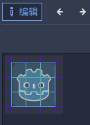
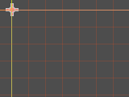
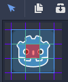
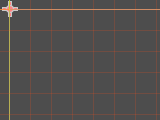
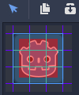
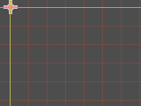

# 1. Line2D 节点

- 在 2D 空间中通过几个点连成的线，可以通过代码动态添加和删除

```
注意：默认情况下，Godot一次最多只能绘制 4,096 个多边形点。
要增加这个限制，请打开项目设置，修改下面两个设置
ProjectSettings.rendering/limits/buffers/canvas_polygon_buffer_size_kb 
ProjectSettings.rendering/limits/buffers/canvas_polygon_index_buffer_size_kb。
```

# 2. RemoteTransform2D 节点

- RemoteTransform2D，类似与设计模式中的代理模式，代理一个节点

```
RemoteTransform2D pushes its own Transform2D to another CanvasItem derived Node in the scene.

It can be set to update another Node's position, rotation and/or scale. It can use either global or local coordinates.
```

# 3. Path2D 节点

- Path2D，包含了一个曲线路径数据

```
Contains a Curve2D path for PathFollow2D nodes to follow，Describes a Bézier curve in 2D space.
```

- PathFollow2D，要和Path2D结合在一起使用

```
This node takes its parent Path2D, and returns the coordinates of a point within it, given a distance from the first vertex.


It is useful for making other nodes follow a path, without coding the movement pattern. For that, the nodes must be children of this node.
The descendant nodes will then move accordingly when setting an offset in this node.
```

# 4. Tilemap 节点

- tilemap的由tileset组成，tileset由tile一个个单个图块组成

- 基本上通过熟练使用get_cell、set_cell、world_to_map这些函数就可以解决大多数普通关卡制作需求

- 自动填充bitmask
- 如图所示，这是一个3×3的autotile（自动图块），如果我还没有设置bitmask（位遮罩），那么此时放置图块时效果如下图所示
- 可以看到，如果没有设置bitmask，那么放置图块时只显示左上角的部分

  
  

- 接下来我把bitmask设置在中心区域，如图所示，接下来，我再放置autotile时，效果就不一样了，效果如下图所示：

  
  

- 可以看到，图中其它图块都是左上角，但中间的部分改变了，接下来我再把bitmask的范围加大，接触到相邻的图块，接下来效果就又不一样了
- 可以看到，当放置了一圈图块后，在中间添加图块时，相邻的图块全都改变了

  
  