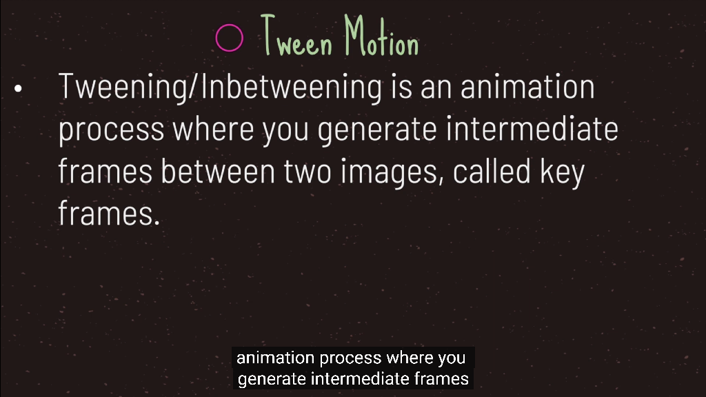
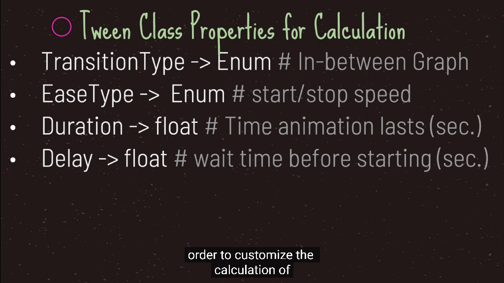
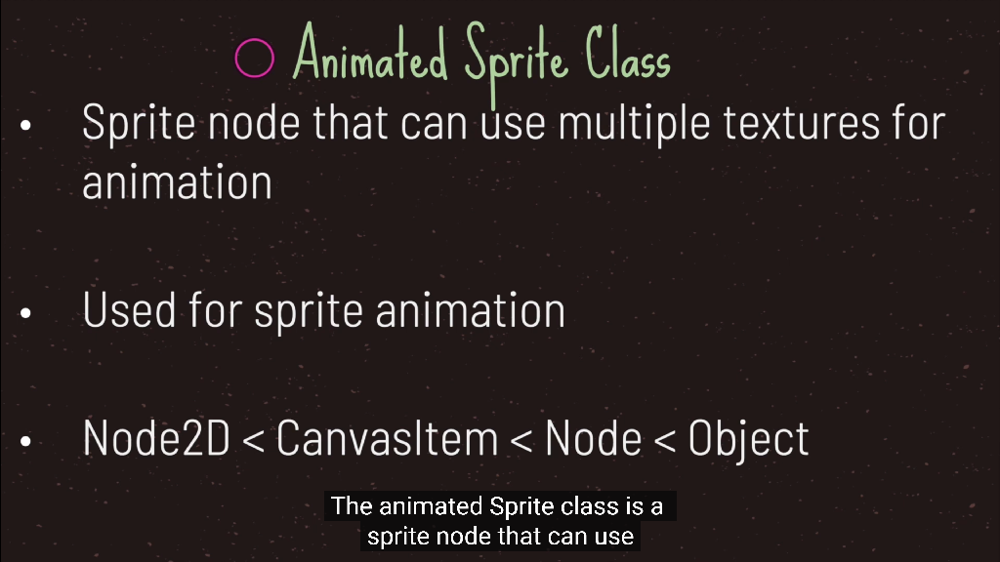
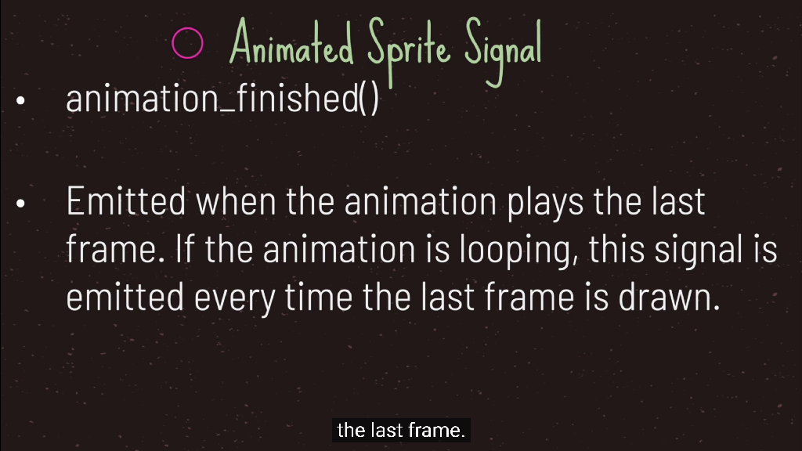

# 1. 动画系统

- godot中的动画其实就是一个一个图片的轮播

```
sprite解释，上世纪70年代，在德州电器公司，一个叫Daniel Hillis的前辈最早把Sprite这个词用在计算机图形上，在展示界面上，
有一些东西在实现层面并不是和整个画面融为一体的，而是『漂浮』在其他画面之上，像『幽灵』一样，所以被称为Sprite。

一张一张的图片组成了一个会动的精灵
```


- godot内置了通用的动画系统用以实现基于关键帧的动画。

```
除了支持标准的位移、旋转、缩放动画和帧动画之外，还支持任意组件属性和用户自定义属性的驱动，
再加上可任意编辑的时间曲线和创新的移动轨迹编辑功能，能够让内容生产人员不写一行代码就制作出细腻的各种动态效果。
```

# 2. 动画之Timer节点实现动画

- Timer节点，意思是计时器秒表，在godot中可以利用他的定时器特性来实现动画帧

```
Counts down a specified interval and emits a signal on reaching 0. Can be set to repeat or "one-shot" mode.
```






- AnimationPlayer是时间和属性的变化，是一种动画的表现
- AnimatedSprite是序列帧的简便的用法




