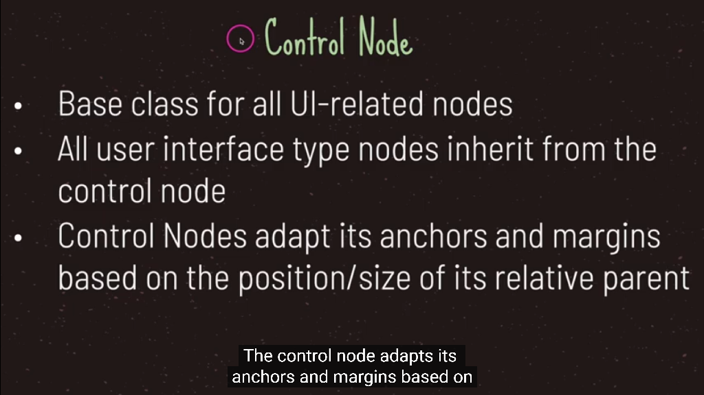
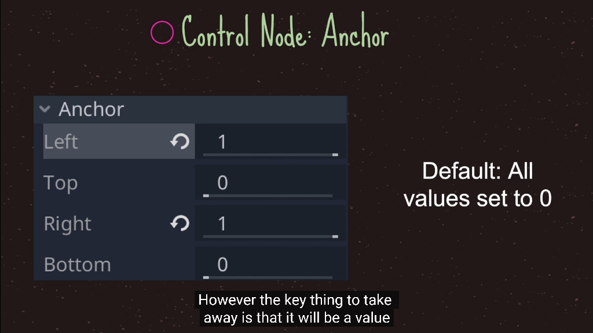
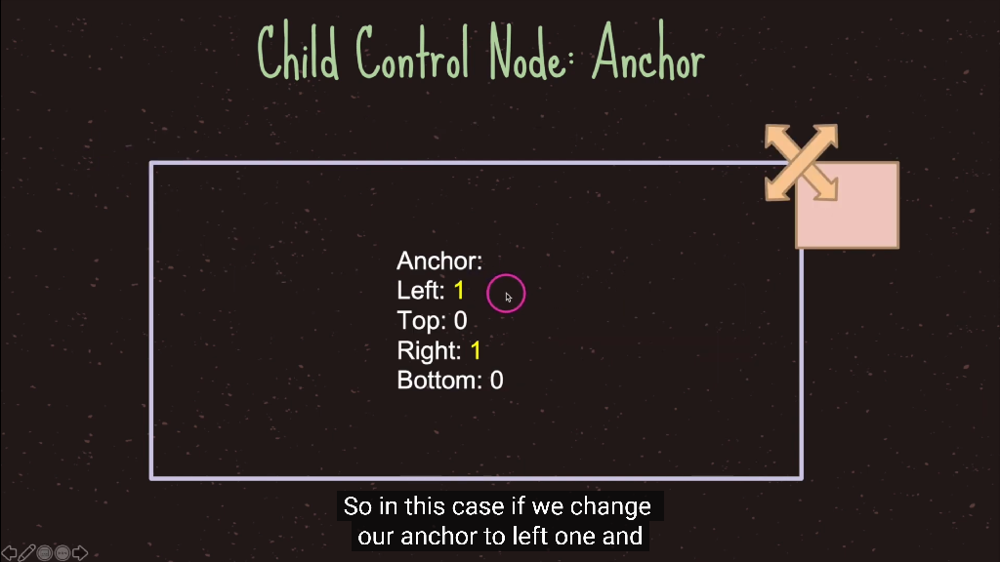
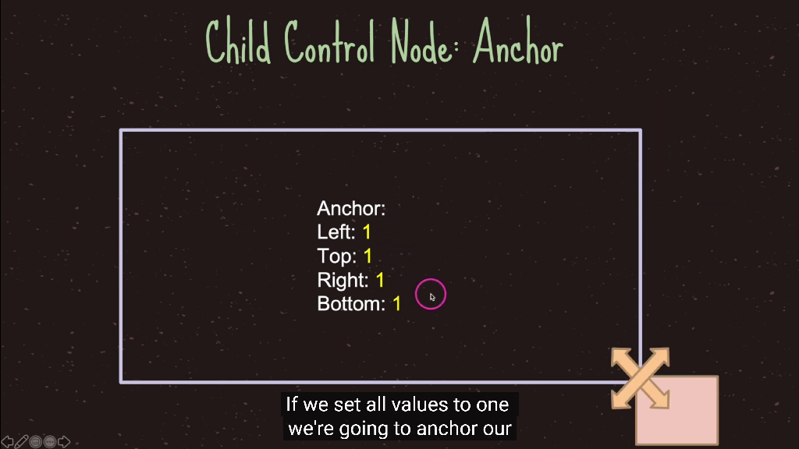
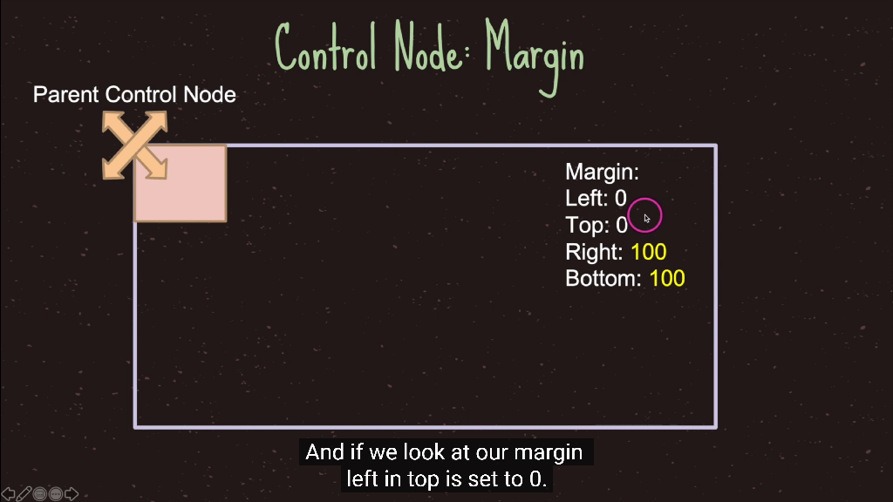
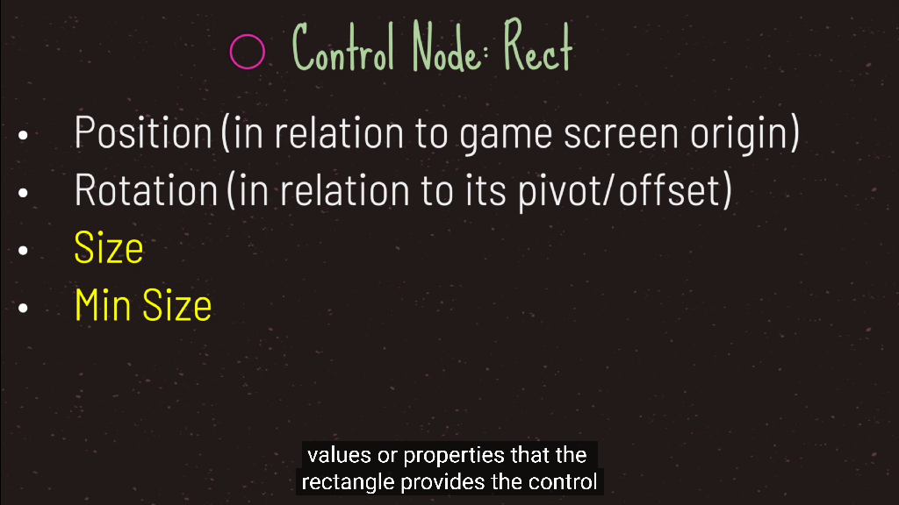

# 1. GUI系统

- 图形用户界面（Graphical User Interface，简称 GUI，又称图形用户接口）是指采用图形方式显示的计算机操作用户界面。

```
图形用户界面是一种人与计算机通信的界面显示格式。
允许用户使用鼠标等输入设备操纵屏幕上的图标或菜单选项，以选择命令、调用文件、启动程序或执行其它一些日常任务。
与通过键盘输入文本或字符命令来完成例行任务的字符界面相比，图形用户界面有许多优点。
图形用户界面由窗口、下拉菜单、对话框及其相应的控制机制构成，在各种新式应用程序中都是标准化的，即相同的操作总是以同样的方式来完成，
在图形用户界面，用户看到和操作的都是图形对象，应用的是计算机图形学的技术。
```



- https://docs.godotengine.org/en/3.3/getting_started/step_by_step/ui_game_user_interface.html

# 2. GUI的字体选择

- 由于 Godot 使用 OpenGL 渲染，所以没法直接用系统字体，需要创建字体资源(Resource)，而且在 UI 组件中，默认字体没法显示中文。

```
在 Godot 中使用自定义字体的步骤如下:

复制字体文件(ttf/tts等格式)到游戏目录内
创建字体资源(DynamicFont) ， 并配置对应字体文件
控件中使用字体资源，配置字体大小，字体颜色
字体资源复用（Make Unique）
```

- godot默认不显示中文，需要下载中文的字体

- windows自带的字体，要收费，有版权风险，C:\Windows\Fonts

- 思源黑体，免费，开源，https://github.com/adobe-fonts/source-han-sans/releases

```
由Google和Adobe在2014年7月正式推出的开源字体不仅可以免费商用而且全面支持中文简体、中文繁体（香港）、中文繁体（台湾）、日文和韩文，还有七种字体粗细，整个字形个数接近50万。

免费可商用
```

# 3. GUI的锚点Anchor

- 是一个点，锚点描述的是一个对象的Margin，相对于锚点的坐标
- 锚点的left，top，right，bottom是相对于父节点的值
- 主要是用于描述子节点相对于父节点的位置
- 当对一个节点的子节点进行设置锚点时，子节点的锚点范围只能够是父节点的控件区域内。
- 注意任何布局也都是相对于父窗口矩形的
- **主要用于在GUI中描述子节点相对于父节点的位置**











